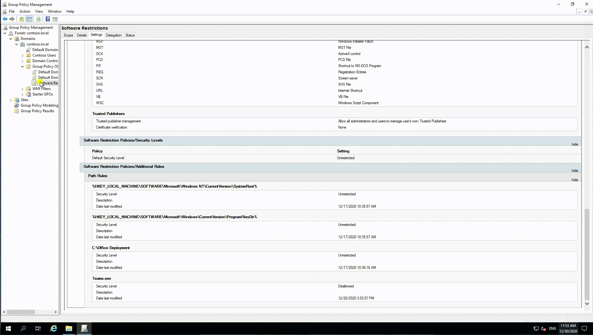

# Create-GPO-From-Template
> Backup and Create GPO for easy distribution across multiple domain controllers across multiple forests. Replicate a single GPO across multiple customers if you're an MSP.

These two scripts are used to Export an existing GPO, and then create the same GPO on a destination domain controller.

## GPO-Backup.ps1

Download just this script to get started!

This script will create a backup/export of an existing GPO with the name '**Software Restrictions**' on an existing Domain Controller. Create your GPO, name it '**Software Restrictions**', and then run this script on the domain controller to export the existing object, download the deployment script, and then package the exported GPO and deployment script into a ZIP Archive that can be distributed for GPO deployment.

**This script uses the 7Zip4Powershell Module from https://www.powershellgallery.com/packages/7Zip4Powershell/1.9.0 which will be installed on the machine automatically if it's not already there. You don't need to install it manually**

## GPO-Creation.ps1

**You do NOT need to download this file.**

Included in the deployment package created by the script above. This script will create a new GPO on the destination domain controller, link it to the root of the domain, and then import the settings from the GPO created using the '**GPO-Backup.ps1**' script.

If a GPO by the same name already exists, the script will update that GPO with the settings from the backup and existing GP Links will be retained. **The Settings will otherwise be overwritten by the new GPO**

## Usage example

* Login to any Domain Controller
* Create a GPO called '**Software Restrictions**'
* Modify the GPO to include the settings you want to replicate on other DCs
* Download only the '**GPO-Backup.ps1**' script into a folder on the source domain controller
* Run the script with no parameters
* The resulting package will be available in the '**Packages**' subfolder where the script was downloaded to.
* Distribute the Package (ZIP archive) to destination domain controllers.
* Extract the contents, and run the **GPO-Create.ps1** script.
* Verify that a '**Software Restrictions**' GPO has been created in the destination environment with the correct settings.
* Link the GPO to whatever containers you require.

## Release History

* 1.1
    * Updated GPO Creation Script to Leave Existing Links in Place if the GPO already exists.
* 1.0
    * Working in Progress/Testing
## Meta

Evan Wilson – evan@aurbor.com

[https://github.com/aurbor](https://github.com/aurbor/)